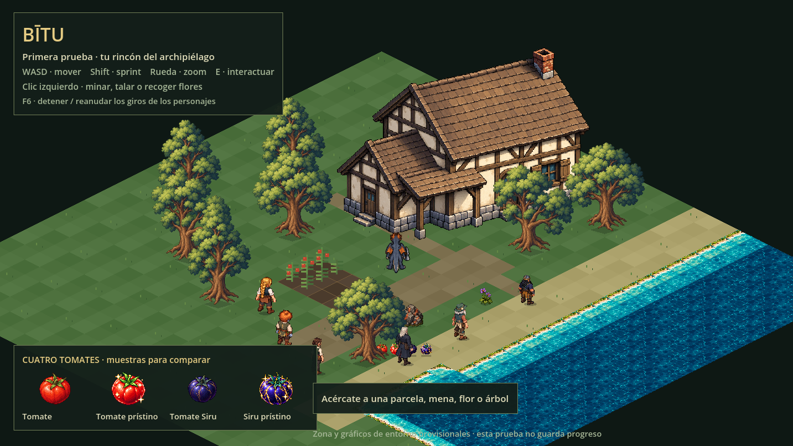

# Bītu y el archipiélago

**Agua y casa integradas:** vivienda rural a escala nativa, colisión ajustada a los cimientos y profundidad respecto al personaje; costa con agua turquesa, zonas profundas y orillas. Agua estática y casa exterior. Descarga local actualizada en `prueba/descargas/bitu-navegador.zip`.

Proyecto de juego individual de fantasía, **íntegramente en pixel art**, con **vista desde arriba isométrica cenital**, centrado en explorar, farmear, mejorar y coleccionar.

**Primera prueba visual jugable:** una zona provisional de Bītu con el **dragón protagonista bípedo rehecho en pixel art, con ocho direcciones y160 registros**. Camina y sprinta con el pico–hacha, mina, tala y usa el palín al arrodillarse. Un clic inicia toda la extracción. Incluye una [revisión ampliada de animaciones](assets/personajes/dragon/README.md). El juego completo continúa en diseño. Consulta [cómo probarla](docs/prueba-visual.md).

Motor elegido: **Godot 4**. Primera plataforma: **navegador en ordenador, con teclado y ratón**. La versión descargable queda como posibilidad futura.

La generación general de imágenes está en pausa; solo se crean recursos cuando el usuario los pide explícitamente.

## Suelos en la prueba

Césped, tierra y arena existentes integrados en la cuadrícula de 64 × 32, con seis variantes y fuentes compartidas. [Captura dentro del juego](prueba/capturas/cesped-tierra-arena-en-juego.png). Descarga de navegador actualizada.

## Mapa y astillero

[Ruinas y camino costero: 48 piezas](assets/entorno/ruinas-camino/README.md), tres atlas con catálogo, recursos de Godot y galería. Preparación final e integración pendientes.

[Mapa de Bītu para el jugador](mapas/README.md) y [exterior/interior del astillero de Flavia](assets/entorno/astillero/README.md), con módulos visuales para su preparación posterior. Fuentes revisadas; todavía no integradas en el juego.

## Documentos

- [Bloc de diseño](DISENO.md): decisiones, personajes, sistemas, secretos narrativos para los creadores, propuestas y pendientes.
- [Propuesta de organización del terreno](docs/terreno.md): cuadrícula isométrica, colocación libre en la granja y convivencia de escenarios, recursos y criaturas.
- [Escala y recursos de todo el archipiélago](docs/escala-y-recursos.md): familias de cultivos, plantas, minerales, peces y criaturas; agua, edificios, barcos, regiones y requisitos gráficos.
- [Esquema global y primer bloque jugable](docs/primer-prototipo.md): estado de preparación y propuesta de alcance para empezar.
- [Siguiente bloque preparado](docs/siguiente-bloque.md): orden de trabajo, recursos disponibles y comprobaciones para la base jugable de farmeo.
- [Primera propuesta de mapa de Bītu](mapas/isla-bitu-propuesta-1.png).
- [Segunda propuesta de mapa de Bītu](mapas/isla-bitu-concepto.png).

Los mapas son conceptuales; ninguna distribución es definitiva. El bloc contiene información narrativa que el jugador desconocerá al principio.

## Recursos gráficos

- [Sprites de agua y casa para desarrollo](assets/entorno/agua-casa/README.md): casa ajustada a la escala del personaje y 24 piezas de agua/orilla, con PNG transparentes, atlas y visor independiente. Publicación solicitada por el usuario, sin integrar en la prueba.

- [Propuesta visual de agua y casa](docs/referencias/README.md): referencia revisada de agua turquesa y casa rural de entramado de madera; publicada por petición del usuario, sin integrar en el juego.

- [Unamahloni — pose quieta en pixel art](assets/personajes/referencias/unamahloni-idle.png): versión original, PNG transparente de 1143 × 1376 píxeles.
- [Notas de uso del personaje](assets/personajes/README.md).
- [Cuatro tomates en pixel art](assets/objetos/cultivos/README.md): común, prístino, Siru y Siru prístino; PNG independientes con fondo transparente.
- [Pico–hacha de hierro](assets/herramientas/pico-hacha/README.md): PNG transparente, medidas, agarre, componentes visuales independientes y escena de revisión animable en Godot.
- [Palín de herborista](assets/herramientas/palin-herborista/README.md): diseño exótico con hoja vegetal, integrado en la recolección arrodillada de flores.
- [Árboles, cobre, Yde y botín](assets/entorno/recursos/README.md): dos atlas transparentes, tres árboles con sus tocones, estados del cobre y dibujos propios del botín, con recortes, anclas y escala registrados. Revisión con `?vista=recursos`.

Para ejecutar la prueba en tu ordenador: instala Godot **4.6.3**, importa `prueba/project.godot` y pulsa **F5** para jugar. También puedes usar la [descarga para navegador](prueba/descargas/bitu-navegador.zip), con Python 3; consulta las [instrucciones de la prueba](prueba/README.md). Movimiento WASD, **Shift para sprint**, rueda para zoom, un clic izquierdo sobre mena, árbol o flor cercana para extraer, E para las otras interacciones y Tab para mostrar la mochila. La prueba no guarda progreso.

Para retomar en otro chat, empezar por el bloc y continuar con una decisión cada vez.

## Personajes dentro de la prueba

Seis NPC de ocho vistas integrados localmente, con colisión y conversación provisional. Protagonista nuevo160 registros, arte anterior retirado. [Auditoría del repositorio y comparativa real de tamaños](docs/revision-personajes-en-juego.md), con dragón80px actual y alternativa72px. F7/F8 permiten compararlos en la misma partida.
