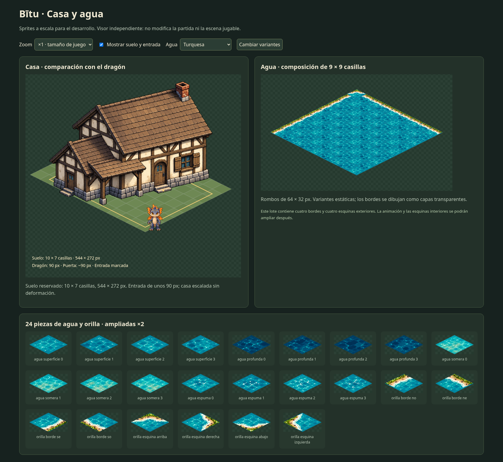

# Casa y agua de Bītu — sprites para desarrollo

Preparados localmente el **9 de octubre de 2026**, por petición del usuario tras aprobar la [referencia visual](../../../docs/referencias/agua-casa-bitu.png). **Publicación en GitHub solicitada después por el usuario, sin aplicarlos al juego.** La publicación anterior solo incluía la referencia.

## Tamaños

| Recurso | Tamaño de PNG | Uso y escala |
|---|---|---|
| Casa | **640 × 512 px**, transparente | Silueta visible de **544 × 414 px** aproximadamente; escala uniforme. Puerta principal de unos **90 px**. |
| Reserva de suelo de la casa | **10 × 7 casillas** | Proyección de **544 × 272 px**, incluyendo porche y acceso; referencia técnica, no colisión definitiva ni ubicación del mapa. |
| Agua | **16 PNG de 64 × 32 px** | Cuatro variantes de superficie, profunda, somera y reflejos/espuma. |
| Orillas | **8 PNG de 64 × 32 px** | Cuatro bordes y cuatro esquinas exteriores, transparentes sobre el agua. |
| Atlas de agua y orillas | **256 × 192 px** | Cuatro columnas y seis filas, con 24 piezas nativas. |

La primera comparación a 8 × 6 casillas dejaba la puerta pequeña junto al dragón de 90 px. Se ha ampliado **toda la casa** hasta una puerta de unos 90 px, sin estirar el cuerpo del edificio ni cambiar por separado ventanas o puertas. La medida anterior de 8 × 6 era una propuesta de planificación; el nuevo registro sirve para preparar este sprite, sin modificar la casa provisional del juego.

La casa mantiene paredes marfil, vigas oscuras, tejado sencillo sin buhardillas, chimenea, porche y contraventanas envejecidas. Su estructura está intacta. No incluye un jardín pegado al sprite ni fija interiores, ampliaciones o accesorios nuevos.

## Archivos

- `sprites/casa.png`: sprite nativo transparente, ancla lógica **(368, 496)**.
- `sprites/agua-*.png` y `sprites/orilla-*.png`: 24 piezas individuales, ancla **(32, 16)**.
- `agua-atlas.png`: las mismas piezas reunidas en un atlas; las orillas se colocan en una capa encima del agua.
- `sprites.json`: regiones, anclas, tamaños, correspondencia del atlas, entrada y huellas SHA-256.
- `casa.tscn`: prefab Godot 4 con dibujo y marcador de entrada, sin lógica ni colisiones.
- `agua-tileset.tres`: TileSet isométrico Godot 4; cuadrícula **64 × 32**, disposición **diamond down**, identificador de sprite y marca de orilla por pieza.
- `vista-previa.html`: visor autónomo con los PNG nativos incorporados; abrir en el navegador para comparar con el dragón, ampliar, mostrar la superficie y alternar tipos de agua.
- `bitu-sprites-agua-casa.zip`: paquete con los sprites, fuentes, registro, recursos Godot y visor, conservando la ruta `assets/entorno/agua-casa/` para uso futuro.
- `casa-fuente.png`, `agua-fuente.png` y `orillas-fuente.png`: originales generados de **1536 × 1024**, conservados intactos.

Para usar los recursos Godot en un proyecto futuro, conservar esta carpeta en **`res://assets/entorno/agua-casa/`**, importar los PNG y usar filtro **Nearest**. Añadir las colisiones y la lógica de acceso cuando se acuerde su implementación. En esta entrega **no se copia nada a `prueba/` ni se cambia su exportación**.

## Preparación y comprobaciones

El arte y la revisión de las orillas se han creado con generación de imágenes a partir de la propuesta aprobada. La preparación técnica registra sus recortes y los presenta a tamaño de juego con vecino más cercano, máscara de rombo y bordes de alpha binario. Solo el plano de agua/orilla se normaliza a 2:1; la casa conserva una única escala en ambos ejes. Las fuentes grandes no son atlas nativos de 64 px.

Comprobaciones realizadas:

- 25 PNG nativos, transparencia real y sin halos semitransparentes.
- Rombo 64 × 32 completo en las 16 aguas; sin píxeles fuera del rombo en todas las piezas.
- Atlas idéntico a los PNG individuales y originales contrastados por SHA-256.
- Casa sin tejado o porche recortados; entrada, apoyo y comparación con el protagonista registrados.
- Visor comprobado en Chromium, con las cuatro familias de agua y sin errores de JavaScript.
- Prefab de casa y TileSet cargados en Godot **4.6.3**, en un proyecto temporal separado. Comprobada la conversión de casillas a desplazamientos de **(32, 16)** y **(-32, 16)**.

Son variantes **estáticas**, no fotogramas de animación. Este lote no incluye todavía esquinas interiores, autotile completo, cascadas, oleaje animado ni interiores de la casa.

Para repetir la preparación: `python3 registrar.py`, `python3 exportar.py`, `python3 registrar.py`, `python3 validar.py`. Requiere Python 3, Pillow y, para exportar y comprobar el visor, Playwright y Chromium. Los scripts no modifican el proyecto jugable.

## Integración posterior

Por petición del usuario, el prototipo utiliza copias idénticas de `sprites/casa.png` y `agua-atlas.png` en `prueba/assets/entorno/agua-casa/`. Los archivos fuente y este paquete de preparación se conservan. La colisión y el orden de profundidad se definen en `prueba/scripts/house.gd`; el terreno conserva la costa no transitable.
