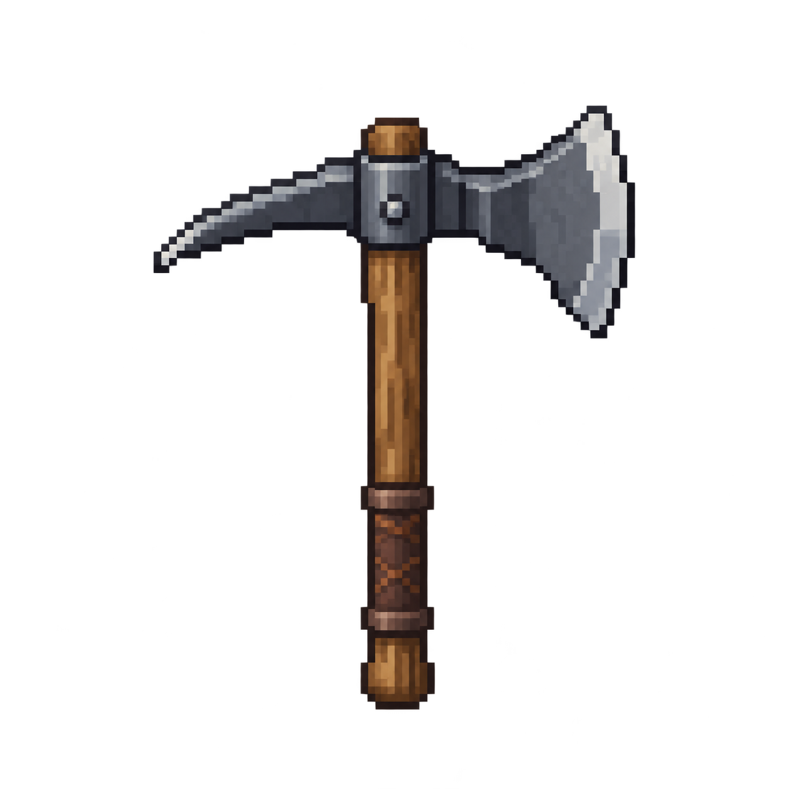
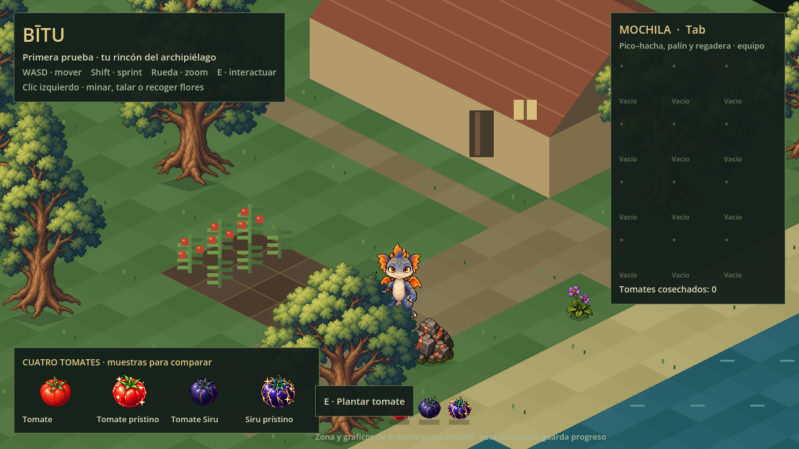

# Pico–hacha de hierro

Una herramienta con **punta de pico a la izquierda y filo de hacha a la derecha**, mango de madera y agarre de cuero. Hierro gris convencional con reflejos plateados, sin gemas ni efectos de rareza. Generada el **8 de octubre de 2026**, a petición del usuario.

**Mejoras independientes aceptadas:** el material del pico cambia ese extremo, y el material del hacha cambia el suyo. El ejemplo «pico de diamante y hacha de hierro» explica la independencia; no confirma que diamante sea un material del juego. Las propiedades, recetas y costes siguen pendientes.

## Medidas y representación

| Referencia | Medida |
|---|---|
| PNG fuente transparente, RGBA | **1254 × 1254 px** |
| Región utilizada del original | x=240, y=164, ancho=776, alto=968 |
| Escala en la escena Godot | **1/16** del original; misma escala para las tres piezas |
| Área presentada del conjunto vertical | **48,5 × 60,5 px** de juego |
| Lienzo de referencia equipado en pose neutra | **64 × 64 px** |
| Humano de referencia | **80 px** de alto |
| Referencia de fotograma humanoide con herramienta | **128 × 128 px**; comprobar márgenes al integrar cada acción |
| Icono / botín | Lienzos **64 × 64 / 32 × 32 px**; la representación de botín usa la mitad de escala |

El PNG original **no es un archivo nativo de 64 × 64**. Las medidas de juego se obtienen con las regiones y escala de la escena suministrada, conservando el original. No hay flechas ni cotas dibujadas sobre el recurso jugable. Filtrado **nearest**, sin mipmaps ni suavizado. La perspectiva es una vista elevada en tres cuartos de la herramienta; no un juego completo de vistas direccionales.

## Componentes y agarre

`pico-hacha-hierro.tscn` compone tres `Sprite2D` mediante regiones `AtlasTexture` del mismo PNG. Las regiones cubren el conjunto sin solapamientos; pico, mango y hacha conservan un único punto de agarre.

| Pieza | Región en el PNG fuente | Posición local respecto al agarre, en píxeles de juego |
|---|---|---|
| Pico | (240,164,314,968) | (-14,5625; -15,75) |
| Mango y collar central | (554,164,150,968) | (-0,0625; -15,75) |
| Hacha | (704,164,312,968) | (14,375; -15,75) |

El **origen del nodo `AgarrePicoHacha` es la mano**, no el centro del PNG. Corresponde al punto **(630,900)** del original, en el cuero. Hay una referencia de segunda mano en (630,690) para una futura postura a dos manos. En la demostración, el agarre se une a (17,-25) respecto al apoyo en el suelo del personaje provisional. La mano se dibuja por delante para tapar el mango donde lo sujeta.

Para mejorar una pieza, sustituir solo su textura mediante `set_part_texture("pick", textura)` o `set_part_texture("axe", textura)`. El método acepta una textura con las mismas dimensiones que la región de esa pieza, devuelve `true` al aplicarla y rechaza tamaños incompatibles. Una nueva `AtlasTexture` puede usar otra imagen con el mismo registro. No recolorear el PNG completo para cambiar solo un extremo. El sistema de mejoras jugables no está implementado por preparar este recurso.

## Animación y efectos

**Integración actual del dragón:** el pico–hacha está dibujado en sus atlas equipados de 80 px de altura. Punta arriba y filo abajo en reposo/marcha, acompañando el brazo. Preparación y golpe de tala tienen un atlas propio. El rig descrito a continuación se conserva como recurso independiente; en el jugador sus sprites se ocultan y solo conserva el reloj/señales. La revisión de `scenes/herramienta.tscn` utiliza las mismas poses completas que el juego. `pose_contact` devuelve el contacto del metal visible registrado en el atlas del cuerpo. Materiales mejorables todavía pendientes de su representación en estos sprites.

- `play_work("minar")`: preparación, golpe con la punta del pico y recuperación.
- `play_work("talar")`: preparación, golpe con el lado del hacha y recuperación.
- Giro alrededor del agarre; duración provisional de **0,62 s**, señal `impact` a los **0,33 s** y señal `work_finished` al terminar.
- Una acción en curso impide iniciar otra; `reset_pose()` cancela y restaura el reposo.
- `contact_point("minar")` y `contact_point("talar")` devuelven la posición global de cada extremo para colocar partículas visuales. No fijan daño, alcance ni tiempo final de extracción.
- `impact_vector(acción)` devuelve el desplazamiento del extremo respecto al agarre en la pose de impacto; el personaje lo usa para orientar el movimiento hacia el recurso.
- Sin colisión propia del PNG: alcance, selección de recurso y reglas de trabajo corresponden al juego.

Es un **rig 2D de una pose**, no una hoja de fotogramas ni las animaciones definitivas del personaje. Al producirlas habrá que coordinar hombros, brazos y ambas manos, comprobar oclusión del torso y recursos, y adaptar o generar las proyecciones necesarias por dirección. Las piezas son asimétricas: al cambiar orientación se debe mantener qué extremo trabaja y qué material pertenece a cada función.

## Revisar en Godot

**Ocho vistas para el dragón (corrección del 9 de octubre):** `pico-hacha-vistas.png` es un atlas transparente de 1774 × 887, orden S, SW, W, NW / N, NE, E, SE. Son proyecciones con ancho y volumen propios; en la espalda se invierte visualmente el orden de los extremos, conservando su función. `pico-hacha-vistas.json` registra agarres, contactos y tres regiones por vista. `set_direction()` selecciona la perspectiva y `contact_offset()` proporciona su contacto local. Los tres componentes siguen separados; mejoras jugables y sus atlas por material pendientes. Las texturas originales y la revisión independiente se conservan.

La copia preparada para el proyecto está en `prueba/assets/herramientas/pico-hacha/`. Abre `prueba/project.godot`, selecciona **`scenes/herramienta.tscn`** y pulsa **F6**. La revisión muestra el dragón con sus poses equipadas, ampliado ×4, y poses de agarre, minería y tala. **1** reproduce minería, **2** tala y **R** restaura las poses. Con **F5**, el jugador de la granja lleva la herramienta: **un clic izquierdo sobre una mena o árbol cercano** completa la extracción, con brazos y ambas manos coordinados de forma provisional. La integración del dragón añade las ocho proyecciones descritas abajo; las mejoras de materiales siguen pendientes.

La escena y `tests/tool-smoke.gd` comprueban registro común, cambio de una pieza sin alterar las otras, dimensiones compatibles, un impacto por acción y recuperación del agarre. El conjunto se importa con Godot 4.6.3. Metadatos completos: [pico-hacha-hierro.json](pico-hacha-hierro.json).
