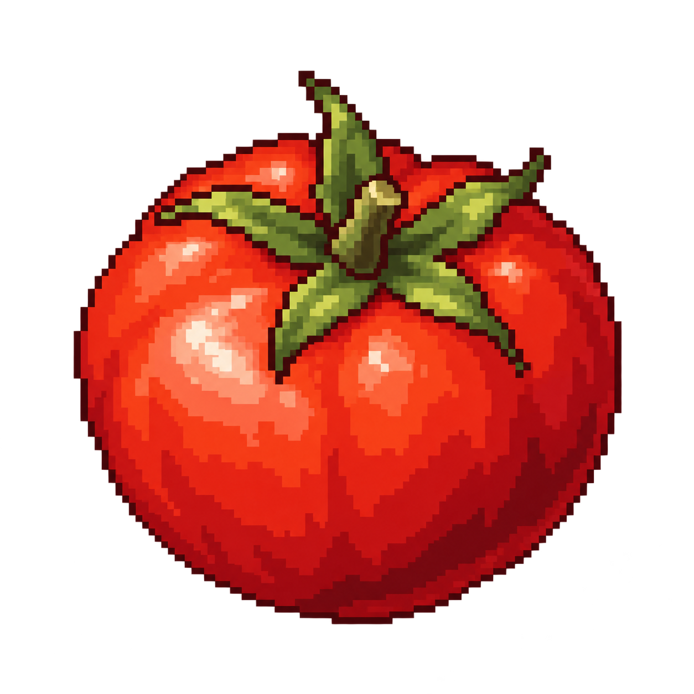
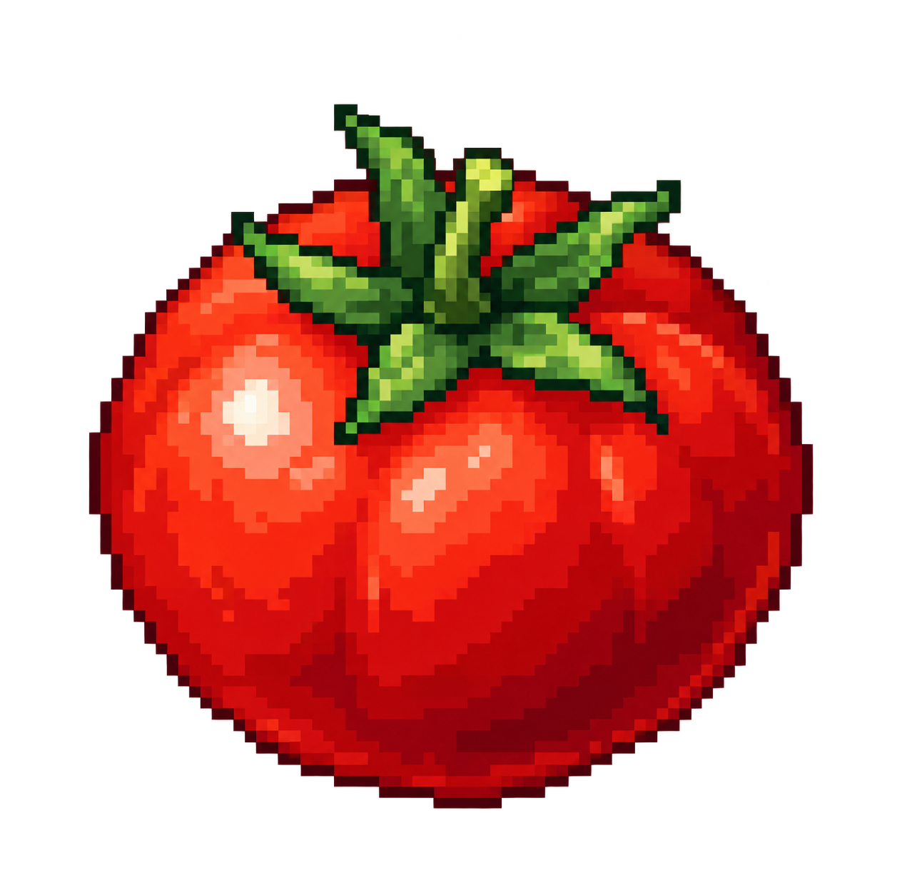
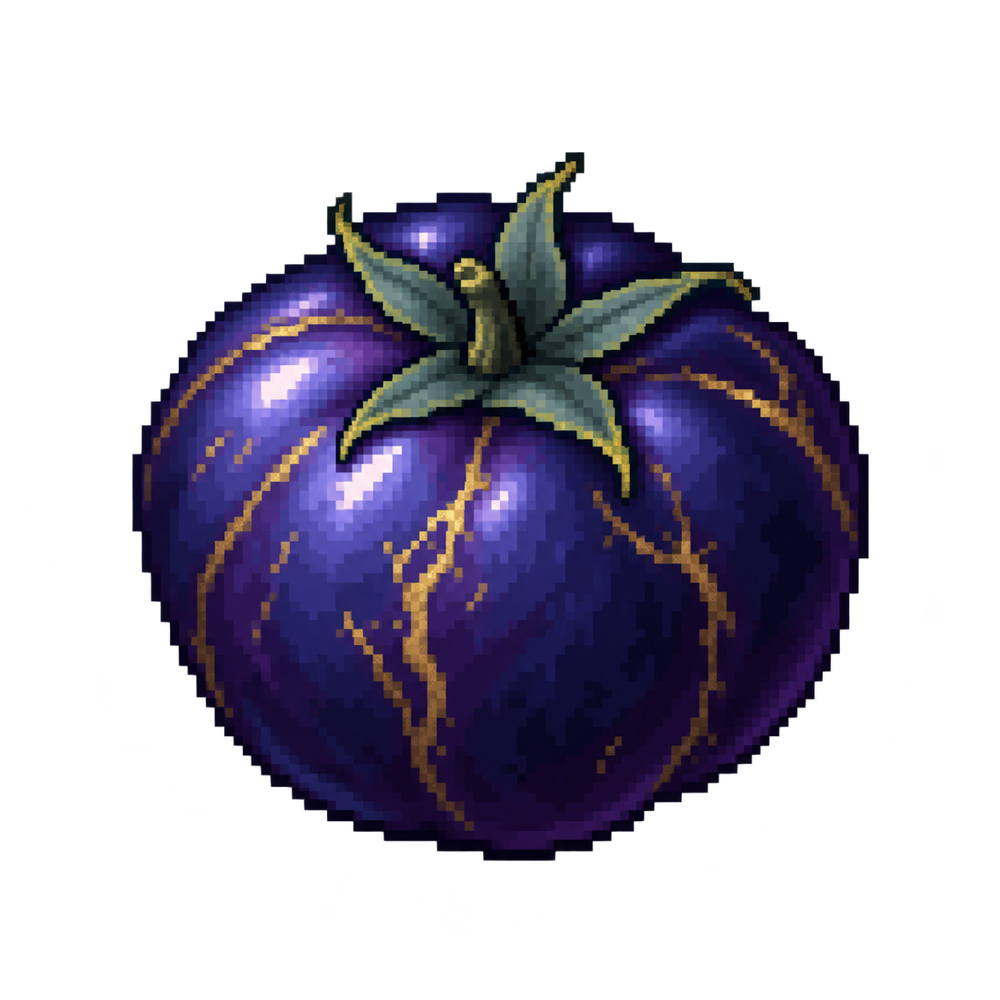
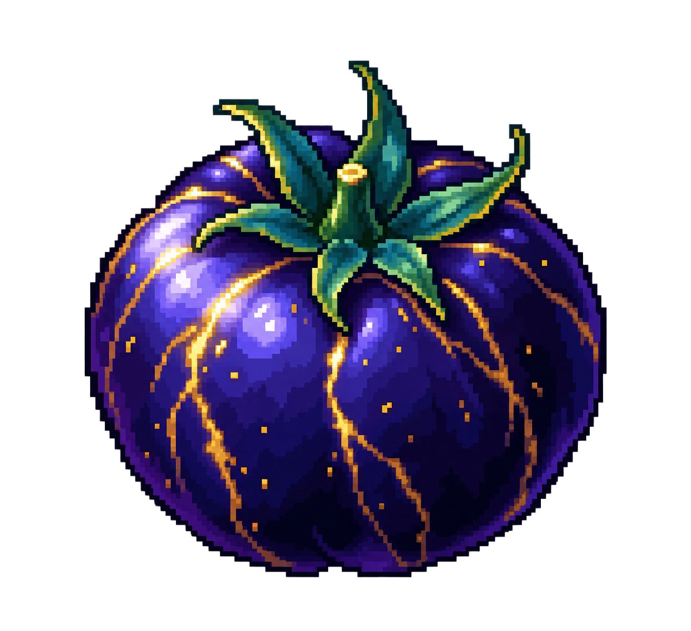

# Tomates — recursos pixel art

Cuatro PNG independientes con fondo transparente, vista elevada en tres cuartos y luz desde arriba a la izquierda. Son iconos de objeto estáticos para importar al futuro juego, no plantas, animaciones ni una hoja de fotogramas.

| Recurso | Vista previa | Paleta de esta propuesta | Dimensiones originales |
|---|---|---|---|
| [Tomate](tomate.png) |  | Rojo natural, hojas verdes. | 1254 × 1254 |
| [Tomate prístino](tomate-pristino.png) |  | Rojo intenso, reflejos limpios y hojas más vivas. | 1264 × 1244 |
| [Tomate Siru](tomate-siru.png) |  | Índigo oscuro, vetas de oro antiguo y hojas verde azulado. | 1254 × 1254 |
| [Tomate Siru prístino](tomate-siru-pristino.png) |  | Índigo, vetas doradas más brillantes y hojas más vivas. | 1312 × 1199 |

## Importación

- Formato PNG RGBA, con canal alfa; conservar la transparencia al importar.
- Los originales generados se conservan sin recortar ni redimensionar. Tienen aspecto pixel art, pero no son archivos nativos de 64 × 64 píxeles ni comparten exactamente el mismo tamaño de lienzo.
- Para escalarlos, usar filtrado por vecino más cercano (*nearest-neighbor*), sin suavizado. Ajustar el tamaño visible y el anclaje de cada icono al integrarlos; escala final y resolución del juego pendientes.
- No se ha creado código del juego. La paleta es la propuesta visual de estos recursos y puede revisarse con el usuario.

**Variante y calidad son independientes:** Siru identifica la variante rara; prístino identifica la máxima calidad. La imagen no establece probabilidades, condiciones de obtención, efectos mágicos ni un brillo animado.

Generados el **7 de octubre de 2026**, a petición explícita del usuario. Esta petición autoriza estas cuatro imágenes; la generación general continúa en pausa. Diseño vigente: [DISENO.md](../../../DISENO.md).
