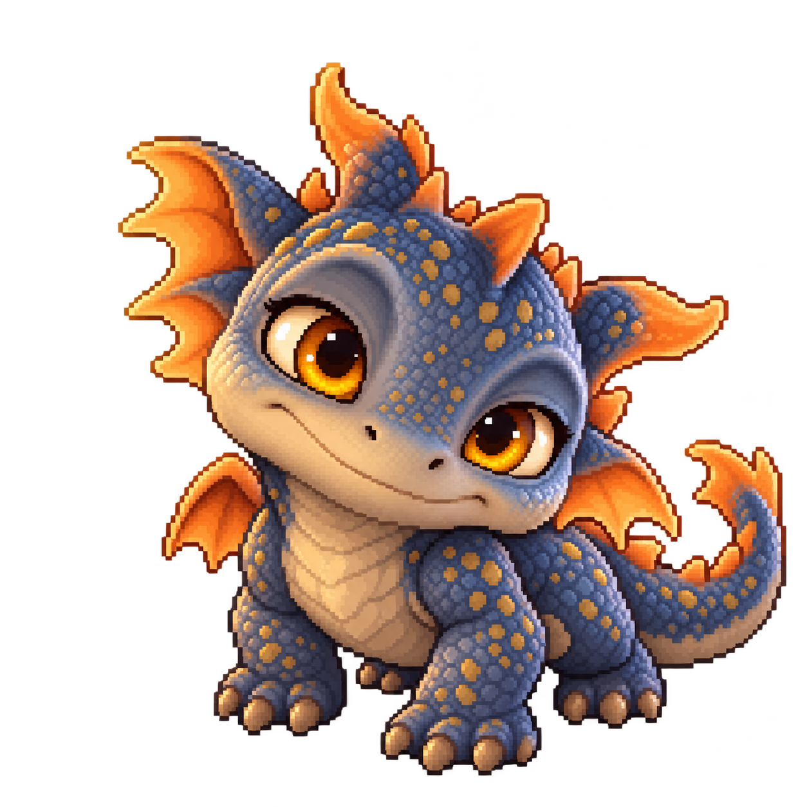

# Dragón — protagonista bípedo

**Revisión pendiente de publicación (10 de octubre de 2026):** el usuario rechaza la tala anterior y el crecimiento aparente al caminar. Reposo comparte ahora el dibujo de contacto A de cada dirección; los cuatro pasos usan una única escala anatómica por ciclo. Retirados los atlas separados de reposo/apoyos/marcha opuesta que mezclaban proporciones. Marcha frontal y norte corregidas manteniendo la anatomía de sus hojas; 112 registros en catálogo v5, ocho atlas jugables. Tala usa el mismo gesto de preparación/carga/golpe que la minería, con el filo ancho como extremo activo; añadida carga propia de tala. PNG y registros de minería conservados exactamente. Esta petición autoriza corregir e integrar y crear los sprites necesarios; no solicita otra publicación. Acabado pendiente de la revisión del usuario.

**Corrección de impactos (10 de octubre de 2026):** el usuario precisa que el árbol se golpea con el filo del hacha y la mena con la punta del pico, y solicita integrar/publicar. Actualizados los dos atlas de trabajo y sus contactos en las ocho vistas, sobre el extremo activo del metal; no sobre el collar ni el mango. Tala usa también su preparación lateral en entrada/recuperación. Las partículas nacen del contacto registrado, incluida la altura propia de la mena. Conservados 80 px, cinco golpes, tiempos, controles y colisión. Esta corrección está autorizada para subir; el acabado visual sigue pendiente de revisión.

Tras revisar la primera integración, el usuario pide rehacer proporciones, cola y animaciones, con **ocho vistas como mínimo**. La revisión posterior reduce la altura de 90 a **80 px** (aproximadamente un 11 %) y dibuja el pico–hacha con el cuerpo. Esta versión conserva la identidad de la cara: ojos ámbar, hocico beige redondeado, sonrisa, piel azul grisácea y aletas naranjas. Las perspectivas nuevas están redibujadas; **no son un recorte idéntico de la cara original**. El PNG original sigue intacto como referencia. Nombre, especie concreta, historia y personalización pendientes.

| Atlas transparente | Dimensiones fuente | Contenido |
|---|---|---|
| `dragon-sin-equipo.png` | 1536 × 1024 | Ocho reposos sin herramienta para recoger flores. |
| `dragon-marcha-frontal.png` | 1312 × 1199 | Cuatro fases en S, SW, E y SE. |
| `dragon-marcha-trasera.png` | 1312 × 1199 | Cuatro fases coherentes en W, NE y NW; fuente previa intacta. |
| `dragon-marcha-norte.png` | 1312 × 1199 | Ciclo N corregido en la fila tercera, con pies opuestos y misma anatomía. |
| `dragon-transiciones.png` | 1312 × 1199 | Agarre preparado; su antiguo paso ya no se usa. |
| `dragon-trabajo.png` | 1261 × 1247 | Carga y golpe de minería en cada dirección. |
| `dragon-tala.png` | 1261 × 1247 | Carga sobre cabeza y golpe como minería, con filo del hacha activo. |
| `dragon-herboristeria.png` | 1536 × 1024 | Recolección arrodillada y elevación. |
| `dragon-jugable.json` | Coordenadas fuente | Regiones, anclas de suelo, palmas y escala uniforme. |
| `dragon-idle.png` | 1254 × 1254 | Referencia cuadrúpeda original, sin cambios. |

Direcciones: **S, SW, W, NW, N, NE, E, SE**. Son dibujos completos: cabeza, torso, brazos, piernas, alas y cola forman parte de cada pose. La cola nace de la pelvis, cambia de perspectiva con el cuerpo y acompaña los pasos; no se coloca como una pieza suelta ni se estira. Se retiran los dos atlas de piezas sustituidos.

La altura erguida y de marcha queda fijada a **80 px antes del zoom**, medida desde el suelo hasta la cresta del cuerpo. Metal y madera no intervienen en esa medida: levantar la herramienta no encoge al personaje. Las poses de trabajo flexionan las rodillas: preparación de 76 px, impacto de 65; recolección de 59 y recuperación de 60. Escala uniforme en ambos ejes, filtro nearest. El catálogo versión 5 contiene **112 entradas**, incluidas 32 de marcha, ocho preparaciones, ocho cargas y ocho impactos propios de tala y ocho reposos sin equipo. La elevación E usa ahora su dibujo propio.

**Al llevar la herramienta, la punta del pico mira arriba y el filo del hacha abajo**, también de perfil y en diagonal. El mango acompaña la mano; no se aplica un giro de herramienta independiente. Cuerpo, manos, dedos y pico–hacha forman un único dibujo equipado. El nodo de herramienta conserva el reloj y las señales de impacto, con sus sprites ocultos para evitar duplicarla. Los atlas de la herramienta separada siguen disponibles para su revisión y futuras mejoras, todavía sin integrar esos cambios de material en los dibujos equipados.

Los contactos se registran sobre metal visible del PNG de impacto. El apoyo visual entra gradualmente, permanece entre los cinco golpes y se recupera al terminar; no altera la posición física, la colisión ni el alcance. El cuerpo se orienta hacia **la base del recurso**, independientemente de la altura del impacto. El palín sigue registrado como herramienta aparte sobre su palma, con cambio de apoyo al agacharse; no desplaza físicamente al jugador.

- Marcha: contacto A → paso A → contacto B → paso B, con cuatro dibujos distintos y herramienta equipada. Los pies traseros avanzan alejándose de la cámara. El ciclo sigue la distancia realmente recorrida, no solo la tecla pulsada; se detiene al quedar bloqueado.
- Minería/tala: preparación → carga → golpe → recuperación; señales y tiempos conservados.
- Herboristería: agacharse → paladas → extracción → elevación → recuperar postura.
- Pesca, regadera, combate, daño y esquive: pendientes de sus sistemas.

[`dragon_visual.gd`](../../../prueba/scripts/dragon_visual.gd) presenta las poses; [`player.gd`](../../../prueba/scripts/player.gd) registra herramientas y orientación. Los ocho atlas y el catálogo tienen copias idénticas dentro de `prueba/` para exportar el proyecto independiente.

**Registro reproducible:** [`register_dragon_80.py`](../../../prueba/tools/register_dragon_80.py) mide componentes completos para no cortar crestas que crucen una celda, separa colores del cuerpo, registra anclas/contactos y copia los PNG a la prueba **sin modificar sus bytes**. Pillow, NumPy y SciPy se usan para leer medidas, no para editar imágenes. `dragon-registro-base.json` conserva referencias anatómicas de la versión anterior, sin ser un catálogo de juego. El registrador anterior deriva a este catálogo para evitar restaurar medidas de 90 px. Los pequeños componentes desconectados se limpian únicamente al presentar el fotograma en memoria.

Esta es una revisión del prototipo, **pendiente de aprobación visual del usuario**. Cuatro fases no equivalen a una animación definitiva de producción; quedan por refinar fluidez y detalles de anatomía/perspectiva.
Importa `prueba/project.godot` en **Godot 4.6.3** y pulsa **F5** para jugar. Cámara inicial de prueba a zoom **1,5**, ajustable con la rueda. Abre `prueba/scenes/dragon.tscn` y pulsa **F6** para ver simultáneamente ocho direcciones ampliadas ×2: **1 reposo, 2 marcha, 3 minar, 4 talar, 5 palín**. En el navegador añade `?vista=dragon` a la URL.

[Marcha](../../../prueba/capturas/dragon-marcha.png) · [Minería](../../../prueba/capturas/dragon-minar.png) · [Tala](../../../prueba/capturas/dragon-talar.png) · [Palín](../../../prueba/capturas/dragon-palin.png)

[Prueba de navegador](../../../prueba/descargas/bitu-navegador.zip) · [Vídeo real del canvas](../../../prueba/capturas/dragon-animaciones.webm) · [Alcance y comprobaciones](../../../docs/prueba-visual.md).

## Referencia original

Creado el 8 de octubre de 2026 a partir del avatar del usuario. Pose cuadrúpeda estática conservada sin redimensionar ni recortar. [Medidas, apariencia y huella SHA-256](dragon-idle.json). La adaptación bípedo posterior sustituye al protagonista humano anterior; Unamahloni mantiene su papel de maestro.

El usuario autoriza generar estas vistas, integrarlas, retirar los recursos sustituidos y subir esta corrección a GitHub. La generación general sigue en pausa y las futuras subidas requieren petición.
