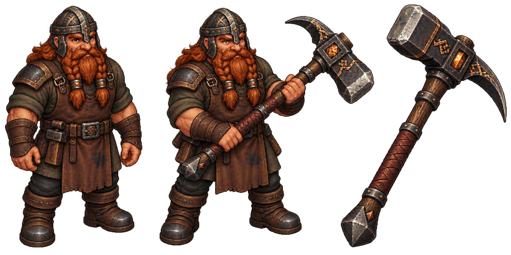

# Maestro minero y herrero enano

Propuesta visual generada por petición explícita del usuario: maestro y arma especial diseñada para él. Fuente original conservada en `maestro-y-quebraveta-fuente.png`, con transparencia y tres presentaciones: personaje sin arma, equipado y arma aislada. Medidas y SHA-256 en `diseno.json`.

Enano de 80 años, joven para una especie que vive unos 300; bajo y fuerte, barba y pelo largos cobrizos, siempre casco, rostro curtido. Gimli es el referente principal. Casco de hierro con detalles de cobre, delantal gastado y ropa de oficio. El personaje sin arma permite preparar posteriormente equipo separado.

**Quebraveta**, nombre propuesto: martillo de guerra con cara de golpe maciza y punta rompe-roca opuesta, sin hoja de hacha. Hierro oscuro, incrustaciones de cobre, mango reforzado de madera y cuero e inserto ámbar decorativo. Arma personal distinta del pico–hacha regalado al protagonista; efectos y estadísticas pendientes.

Esta entrega es una propuesta visual para revisar. No contiene animaciones, puntos de agarre registrados ni sprites nativos definitivos. La altura de 60–64 px sigue siendo una escala propuesta para su futura adaptación. El usuario solicita publicar esta entrega concreta en GitHub. No se ha integrado en `prueba/`; animaciones y adaptación jugable pendientes.

