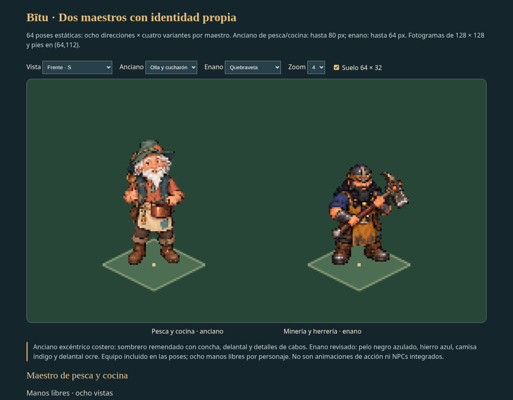

# Maestros de Bītu — anciano costero y enano revisado

Entrega del **10 de octubre de 2026**, generada por petición del usuario; publicación en GitHub solicitada al terminar. Los diseños de referencia anteriores se conservan. Esta entrega no integra NPCs en el juego.

## Personajes

**Maestro de pesca y cocina:** anciano y excéntrico —«loco como Radagast», según el usuario—, tranquilo, conversador, amante de la naturaleza y entusiasta de los hallazgos raros. Diseño propio para Bītu: pelo y barba blancos revueltos, sombrero verde mar remendado con parche coral y concha, camisa terracota, chaleco azul verdoso, delantal crema, cabos y adorno de pez. Nombre, especie y edad exacta pendientes. Estos detalles de vestuario son la propuesta visual creada; no fijan poderes ni nuevas historias.

**Maestro minero/herrero enano:** conserva la baja estatura, fuerza, rostro curtido, pelo y barba largos y casco permanente. Tiene 80 años y es joven para su especie de unos 300. A petición del usuario se distingue del primer diseño demasiado parecido a Gimli: pelo negro azulado, casco de hierro azul y latón, camisa índigo, delantal ocre y correas cruzadas. Quebraveta conserva el martillo y la punta rompe-roca; sin hoja de hacha. [Primer concepto conservado](../maestro-enano/README.md).

## Vistas y equipo

Cada variante tiene **ocho vistas**, incluidos frente, perfiles, diagonales y espalda:

| Maestro | Manos libres | Variante de oficio 1 | Variante de oficio 2 | Comida |
|---|---|---|---|---|
| Anciano | 8 | 8 con caña corta de viaje | 8 con olla y cucharón | 8 ofreciendo un cuenco |
| Enano | 8 | 8 con Quebraveta | 8 con martillo de forja y tenazas | 8 con bandeja de pan, queso y tomate |

**64 poses estáticas**, ocho fuentes originales y ocho atlas. Los alimentos son ejemplos visuales; no definen recetas, producción, efectos ni requisitos del juego. Las poses equipadas incluyen los objetos en el dibujo; no son capas intercambiables ni animaciones de comer, pescar o forjar. Las manos libres permiten preparar equipo separado después.

## Medidas y archivos

- Sprites nativos: **128 × 128**, RGBA y alfa binaria (0/255).
- Alturas de revisión: anciano hasta **80 px** incluido el sombrero; enano hasta **64 px** incluido el casco. Apoyo común **(64,112)**; suelo de referencia **64 × 32**.
- Atlas: **512 × 256**, cuatro columnas por dos filas para cada variante. Orden normalizado **S, SO, O, NO; N, NE, E, SE**, relativo a la pantalla. N es espalda.
- `fuentes/`: ocho PNG originales conservados intactos. El orden original del enano es diferente y se registra en el JSON; se reordena al exportar, sin espejar personajes ni accesorios.
- `sprites/<maestro>/<variante>/`: 64 PNG a escala. `sprites.json`: recortes, escala, apoyo, orden real y SHA-256.
- `cocinero-frames.tres`, `enano-frames.tres` y sus `.tscn`: recursos Godot 4 con 32 poses por maestro. Rutas relativas, dibujo desde (-64,-112), selección por `libre_s`, `comida_no`, `quebraveta_e`, etc.
- `vista-previa.html`: visor autónomo con dirección, variantes independientes, ampliación y suelo. Abrir en el navegador; funciona sin servidor.
- `revision-manos-libres.png`, `revision-instrumentos.png`, `revision-comida.png`: capturas reales del visor a escala.
- `exportar.py`: exportación técnica con Playwright y Chromium; `validar.py`: comprobación de lectura con Pillow.
- `bitu-maestros-sprites.zip`: paquete completo, con fuentes, sprites, atlas, visor y recursos.

La extracción usa los huecos transparentes reales entre figuras para evitar recortar manos o herramientas. Se corrigieron las láminas de Quebraveta y forja para dar margen suficiente. Cada lámina se reduce uniformemente a la altura del maestro, sin deformar el cuerpo: las ocho vistas comparten escala y pies. El filtro es nearest; umbral de alfa 128. Los originales grandes no son ampliaciones exactas de la cuadrícula nativa; revisar detalles, continuidad y lateralidad antes de desarrollar animaciones.

## Comprobación

Validadas las 64 poses, transparencia, márgenes, alturas, orden real, apoyo, SHA-256 y concordancia con sus atlas. Visor comprobado en Chromium: ocho direcciones, cuatro variantes por maestro, zoom y suelo. Godot 4.6.3 carga ambos prefabs y las 32 poses de cada uno. El ZIP se comprueba con CRC y contenido idéntico a los archivos entregados; se verifican los tamaños frente al límite de GitHub.

No se añaden marcha, sistemas de cocina/pesca ni integración en `prueba/` por esta entrega.

