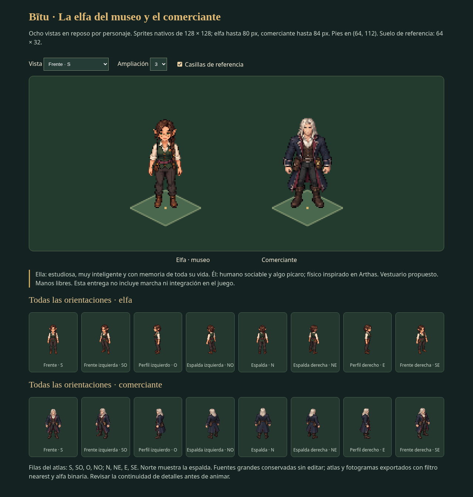

# La elfa del museo y el comerciante

Entrega del **10 de octubre de 2026**, generada por petición explícita del usuario. Dos personajes con **ocho vistas en reposo cada uno**, preparados a escala para revisar y publicar en un siguiente paso.

## Aspecto y acuerdos

- **Elfa, dueña del museo:** personaje secundario que recibe los objetos del jugador. Estudiosa, muy inteligente —probablemente la más inteligente del reparto— y con memoria de todo desde su nacimiento. Atenta y precisa; se descarta la propuesta de distraída. La imagen propone gafas pequeñas de bronce, pelo castaño en trenza, camisa marfil, chaleco verde, cinturón ciruela y bolsa de útiles. Nombre, edad y explicación de su memoria pendientes.
- **Comerciante, su pareja:** humano, sociable y algo pícaro. Arthas, el caballero de la muerte, es la referencia física indicada por el usuario: rostro anguloso, hombros anchos y pelo largo claro. La imagen lo adapta a comerciante con abrigo azul oscuro, forro burdeos, chaleco y bolsas; no establece condición de no muerto, armadura, poderes ni armas.
- Los detalles nuevos de vestuario y ejecución son propuestas visuales, no nuevas historias ni sistemas confirmados. Ambos tienen las manos libres para añadir objetos en un paso posterior.

## Archivos y escala

| Archivo | Contenido |
|---|---|
| `fuentes/elfa-museo-vistas.png`, `fuentes/comerciante-vistas.png` | Originales RGBA de 1536 × 1024, conservados sin modificar. |
| `sprites/elfa-museo/`, `sprites/comerciante/` | Ocho PNG por personaje, **128 × 128**, alfa binaria. |
| `elfa-museo-atlas.png`, `comerciante-atlas.png` | Atlas **512 × 256**, cuatro columnas por dos filas. |
| `sprites.json` | Regiones, escala uniforme por personaje, apoyo, medidas y SHA-256. |
| `*-frames.tres`, `*.tscn` | SpriteFrames y escenas Godot 4; ocho orientaciones de reposo, un fotograma por orientación. |
| `vista-previa.html` | Visor autónomo: dirección, zoom y suelo de referencia. Abrir directamente en el navegador. |
| `revision-a-escala.png` | Captura real del visor con ambos personajes y todas sus vistas. |
| `exportar.py`, `validar.py` | Exportación técnica con Chromium/Playwright y validación de lectura con Pillow. |

**Elfa: hasta 80 px de alto. Comerciante: hasta 84 px.** Fotograma de 128 × 128; apoyo de pies en **(64,112)**. Suelo de referencia 64 × 32. El comerciante es ligeramente más alto; ambas medidas son de revisión, no un cambio a la escala general del juego.

Orden del atlas: fila superior **S, SO, O, NO**; inferior **N, NE, E, SE**, relativo a la pantalla. N muestra la espalda. Las vistas son dibujos separados, sin generar direcciones por espejo.

Los sprites se exportan de las fuentes grandes mediante recorte técnico, reducción uniforme por personaje y filtro nearest. Alfa normalizada a 0/255 con umbral 128. No son una ampliación exacta de las fuentes; la reducción pierde detalle y conviene revisar los grupos de píxeles, las gafas, los accesorios y pequeñas variaciones entre vistas antes de animar. La continuidad de la trenza y las bolsas no se considera una lateralidad definitiva.

Para una futura integración, copiar esta carpeta al proyecto Godot y cargar las escenas: sus recursos usan rutas relativas. Seleccionar `reposo_s`, `reposo_so`, etc.; cada escena coloca el dibujo desde (-64,-112). Los anclajes de manos y las colisiones siguen pendientes.

## Comprobaciones y alcance

Comprobados los 16 PNG, transparencia, dimensiones, alturas, apoyo, recortes del atlas y huellas de las fuentes. Visor probado en Chromium: 16 vistas, cambio de dirección, zoom y casilla. Godot 4.6.3 carga ambos prefabs y las ocho orientaciones sin errores.

**No incluye marcha ni acciones animadas. No está integrado en el juego.** Tras preparar y mostrar la entrega, el usuario solicita publicarla en GitHub con su visor y paquete ZIP. La autorización se limita a esta publicación, sin futuras subidas automáticas.

