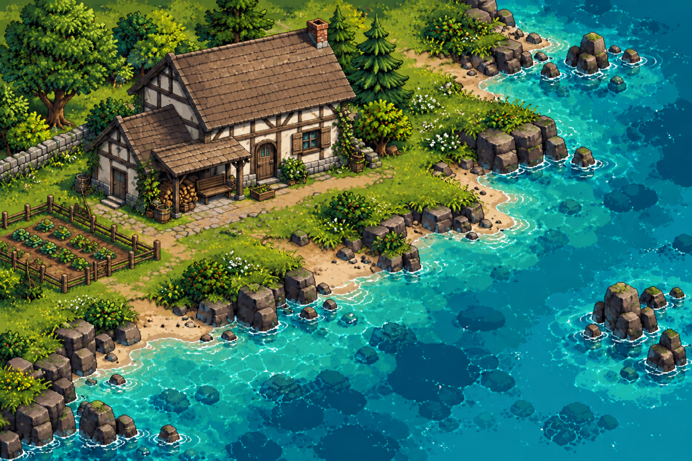

# Propuesta visual de agua y casa

Revisión del **9 de octubre de 2026**, basada en las dos referencias aportadas por el usuario.

- **Agua:** turquesas, profundidad azul, reflejos y espuma junto a la costa.
- **Casa:** paredes marfil y entramado oscuro, tejado envejecido y porche de aspecto granjero. En esta revisión se han retirado las ventanas abuhardilladas para simplificar el tejado y se ha añadido desgaste discreto a las contraventanas.

Imagen PNG de 1536 × 1024 píxeles, sin transparencia. Es una propuesta visual conjunta, no un atlas ni un asset separado preparado para colocar en Godot.

El usuario solicita publicar esta referencia **sin aplicarla al juego**. No cambia escenas, colisiones, controles, distribución del prototipo ni la descarga jugable. Los accesorios y el paisaje de la imagen no fijan nuevos sistemas o decisiones de mapa.

Consulta el [bloc de diseño](../../DISENO.md) para el alcance y los acuerdos vigentes.
