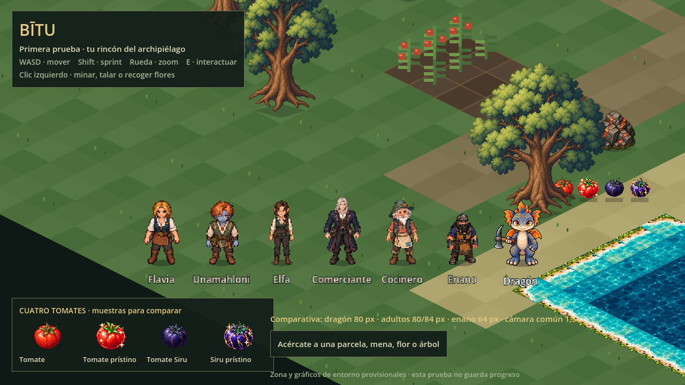
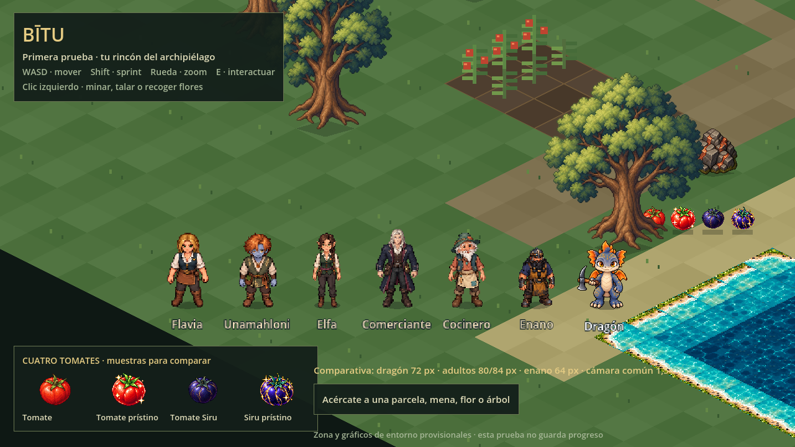

# Personajes dentro del juego: auditoría y comparación de tamaños

Revisión del 10 de octubre de 2026, solicitada para explicar el funcionamiento, comprobar el repositorio e integrar los NPC con capturas reales.

## Resultado de la medición

**El lienzo 128×128 no es la altura del personaje.** Incluye el margen transparente y el espacio de equipo. La comparación correcta mide los píxeles visibles desde el apoyo de los pies y usa el mismo zoom de cámara.

| Personaje | Alto visible de frente, en píxeles de mundo | Ancho visible de frente |
|---|---:|---:|
| Flavia | 80 | 45 |
| Unamahloni | 80 | 41 |
| Elfa | 80 | 31 |
| Comerciante | 84 | 46 |
| Cocinero | 80 | 40 |
| Enano | 64 | 39 |
| Dragón sin equipo, ajuste actual | 81,7 | 50,6 |

NPC: medición del alpha de los PNG nativos. Dragón: recorte sin equipo, limpieza de componentes pequeños como hace el juego y aplicación del factor de su catálogo. Sus ocho vistas sin equipo dan 81,55–82,46px visibles aunque la referencia nominal sea 80px. La diferencia de unos 2px es menor que la diferencia de proporciones.

La cabeza grande, las alas y la cola dan más volumen al dragón; la elfa es especialmente estrecha. Los NPC tienen proporciones más estilizadas. **Ajustar la escala por código puede cambiar el tamaño; no cambia la proporción cabeza/cuerpo, la paleta o la perspectiva del dibujo.** Aumentar todos los NPC para igualar su volumen también aumenta su altura respecto a la puerta, árboles y casillas.

## Capturas reales y cómo compararlas

Todas estas capturas son del motor Godot exportado a WebGL, a 1280×720. Las comparativas usan el mismo mapa, zoom común de 1,5× y los mismos apoyos. La vista general de la partida usa zoom 1×. No son montajes de ilustraciones.

| Comparación | Dragón actual, referencia 80px | Alternativa 72px |
|---|---|---|
| Frente | [Abrir captura](../prueba/capturas/npc-escala-frente-80.png) | [Abrir captura](../prueba/capturas/npc-escala-frente-72.png) |
| Diagonal | [Abrir captura](../prueba/capturas/npc-escala-diagonal-80.png) | [Abrir captura](../prueba/capturas/npc-escala-diagonal-72.png) |

[Espalda, actual](../prueba/capturas/npc-escala-espalda-80.png) · [Vista de la partida](../prueba/capturas/npc-en-partida.png).

La alternativa 72px reduce solo al dragón un 10%: cuerpo, arma dibujada, palmas y contactos reciben el mismo factor. Se conserva el apoyo del suelo. **80px sigue siendo el ajuste inicial; 72px es una propuesta reversible para revisar, no una aprobación visual ni un rediseño anatómico.** Las diferencias originales de estatura de los NPC se conservan.

## Cómo usa la programación estos recursos

1. **Personaje y posición.** El nodo del personaje representa sus pies en el mundo. El dibujo se coloca encima de ese origen; un margen transparente no levanta al personaje del suelo.
2. **Sprite y vista.** Los NPC usan el mismo recurso de ocho poses. Al mirar hacia el jugador, el código selecciona frente, perfil, espalda o diagonal. No inventa una animación de marcha ni duplica sprites.
3. **Tamaño visible.** Los NPC se dibujan a escala 1:1. El dragón utiliza el recorte y las medidas corporales de su catálogo, más un único factor ajustable para todas sus poses. Nunca se cambia solo el ancho o solo el alto.
4. **Colisión.** El círculo físico está en los pies; alas, pelo, barba y arma dibujada no bloquean el mundo por ocupar píxeles. Cambiar la escala de dibujo no multiplica automáticamente el círculo físico.
5. **Profundidad.** Todos pertenecen al mismo grupo ordenado por posición vertical del suelo. Si el jugador pasa detrás de un NPC o árbol, queda detrás de su dibujo; la cabeza no decide la profundidad.
6. **Acciones.** El protagonista selecciona marcha, minería, tala o recolección. Sus contactos se calculan con el mismo factor que el cuerpo, de modo que el extremo dibujado siga golpeando el recurso. Los NPC solo giran y responden a la interacción de prueba.
7. **Cámara.** El zoom amplía por igual personajes y escenario. Con zoom 1,5, un NPC de 80px ocupa unos120px en pantalla. Cambiar el zoom no cambia su estatura en el mundo.

El formato de imagen, el tamaño dibujado, el área de colisión y el zoom son medidas distintas. Se mantienen coordinadas mediante anclas, metadatos y pruebas; no conviene modificar la escala del nodo físico completo para resolver una diferencia de dibujo.

## Qué se implementó

- Los seis NPC están en `main.tscn`, con ocho vistas cada uno y colisión en pies. `npc.gd` carga sus prefabs vigentes; no hay imágenes nuevas ni variantes sobrantes.
- Posiciones **provisionales en el mapa de prueba**, no la distribución definitiva de casas, astillero o museo.
- Al acercarse, miran al jugador. E muestra una respuesta identificada como conversación de prueba; no añade historia, misiones, comercio, donación ni servicios de oficio.
- F7 restablece el dragón 80px; F8 prueba 72px cuando no está trabajando. Al recargar vuelve a 80. También funciona en la revisión `?vista=personajes`.
- Las URLs `?captura=escala-frente&altura=80` y `?captura=escala-frente&altura=72` preparan una fila despejada dentro del mapa para comparar. Diagonal y espalda usan `escala-diagonal` y `escala-espalda`. `?captura=habitantes` muestra las posiciones normales con el protagonista en una zona despejada. La colocación uniforme es un modo de captura; al jugar normalmente conservan sus posiciones provisionales dispersas.

## Estado del repositorio completo

| Área | Estado encontrado |
|---|---|
| Juego | Un único proyecto Godot 2D en `prueba/`, exportable a navegador. Zona provisional 32×32; no es Bītu completa. |
| Protagonista | 104 poses y ocho direcciones; movimiento, sprint, minería, tala y palín. Equipo de trabajo integrado en los dibujos. |
| NPC |48 sprites nativos, seis × 8. Ahora integrados en la prueba; conversación básica provisional. |
| Entorno | Agua y orillas con atlas, casa exterior con colisión y profundidad; árboles/tocones, cobre/Yde y botín. Parte del suelo y cultivos siguen dibujados por código. |
| Recursos adicionales | Miutu y atlas de hierba/tierra existen como assets de referencia, sin conectarse aún al runtime de la prueba. |
| Sistemas | Mochila provisional 12/50, recogida por proximidad, riego y crecimiento básico, extracción automática de cinco golpes. |
| Pendientes funcionales | Guardado, regiones y transiciones, inicio ruinas–astillero, interiores, diálogos definitivos, comercio, museo, pesca, recetas, profesiones y barcos. El prototipo no implementa todavía las reglas finales de cosechas sucesivas. |
| Organización | Fuentes y referencias en `assets/`; recursos independientes de ejecución en `prueba/assets/`; diseño en `DISENO.md` y `docs/`. Los PNG de NPC y catálogo del dragón coinciden con sus copias de ejecución. |
| Documentación | Las notas antiguas conservan cantidades y propuestas históricas. Se corrigieron dos enlaces a la antigua ruta de la imagen base de Unamahloni. Esta revisión describe el estado actual. |
| Optimización futura | El dragón recorta y limpia sus fuentes la primera vez que usa cada pose y luego las guarda en caché. Preprocesar esos recortes puede reducir trabajo inicial; no se ha redibujado ni cambiado el catálogo por esta auditoría. |

## Validación y reproducción

- `tests/npc-smoke.gd`: seis NPC, ocho vistas, suelo transitable, orientación, interacción, colisión; escala reversible y contactos de pico/hacha/palín en ocho direcciones a 80 y 72px.
- Regresión de protagonista, escenario y entorno; conserva 104 poses, cinco golpes, tiempos y acciones existentes.
- `tools/npc_browser_smoke.py`: capturas y arranque/movimiento real en WebGL, sin errores de script. `capturas/npc-comparativa.json` registra viewport, zoom, dirección y altura.
- Archivos y referencias estáticas de Godot comprobados: sin rutas inexistentes. PNG de NPC, originales del dragón y número de sprites conservados.

Prueba local: importar `prueba/project.godot` y F5. Para la revisión aislada, abrir `scenes/personajes.tscn` y F6. En navegador, ejecutar `JUGAR.py` desde el ZIP actualizado y añadir los parámetros a la dirección abierta.
