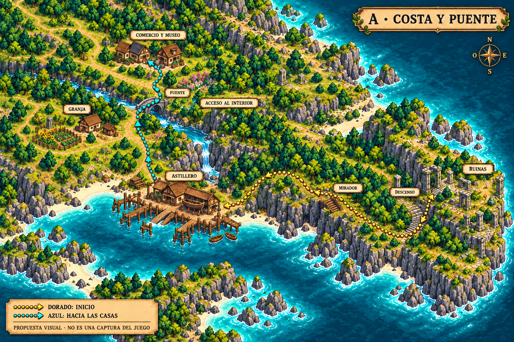
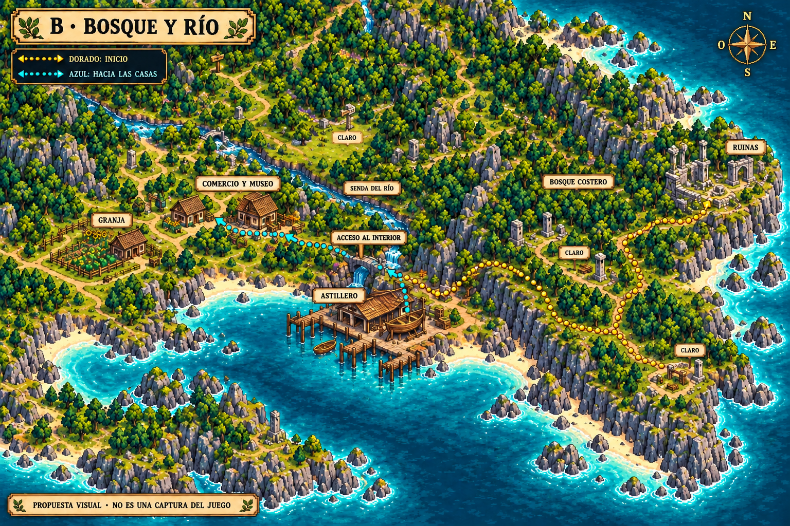
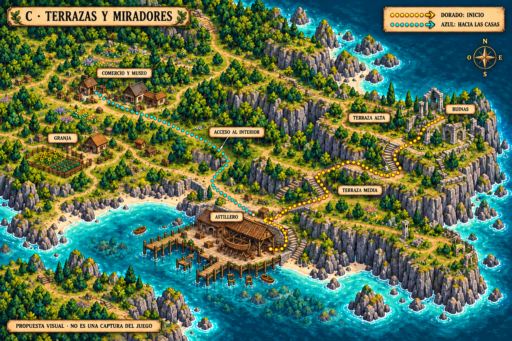

# Tres recorridos para el comienzo de Bītu

Propuestas solicitadas el **11 de octubre de 2026**. Ninguna variante está elegida ni integrada. Las imágenes son esquemas ilustrados en pixel art a escala de recorrido; condensan varias pantallas y no son capturas ni escenarios jugables.

La geografía sigue [el mapa de referencia](../isla-bitu-concepto.png): ruinas al este, astillero junto a la bahía del sureste y comercio/museo hacia el oeste, próximos a la granja. «Pueblo» se usa aquí para las pocas casas dispersas del interior, sin añadir una ciudad, una plaza ni habitantes. La mina y herrería siguen lejos, al noroeste; el maestro está de visita en el astillero.

## Cómo se avanza

**Ruinas → astillero:** despertar en el patio abierto, encontrar la salida hacia el sendero y recorrer un camino largo con cambios de paisaje hasta el patio del astillero. Rocas, desniveles y vegetación impiden desviarse al interior antes de conocer a Flavia y al herrero. Los pequeños recovecos regresan al mismo camino. No hacen falta herramientas, combate ni construir el barco para llegar.

**Astillero → casas del interior:** después del encuentro, salir por el camino de tierra situado detrás del patio de trabajo. Este camino alcanza un acceso natural al interior y continúa hacia comercio/museo; cerca se desvía la entrada a la granja. El comerciante puede presentar la casa durante ese recorrido, como ya se acordó. Su posición, el diálogo y la condición concreta de apertura del acceso siguen pendientes. El barco abre después el viaje marítimo; no es necesario para caminar al interior de Bītu.

En las láminas, **dorado** indica ruinas–astillero y **azul** el recorrido posterior hacia las casas. El sentido de avance se explica por los destinos; el regreso no se convierte en un trayecto de sentido único.

## Las tres variantes

| Opción | Ruinas → astillero | Astillero → comercio/museo | Qué aporta / qué hay que cuidar |
| --- | --- | --- | --- |
| A · Costa y puente | Descenso, sendero costero, tramo arbolado, mirador sobre una cala y llegada al taller. | Prado, puente de piedra sobre agua dulce y acceso a las casas junto al desvío de la granja. | Orientación clara y vistas de la bahía. Variar curvas y claros para evitar repetir acantilados. |
| B · Bosque y río | Descenso, corredor de bosque costero, claros, salida a una cala y llegada al taller. | Senda ribereña, puente sobre el río y prado de comercio/museo. | Mayor sensación de descubrimiento. Mantener visible el suelo y señales naturales entre árboles. |
| C · Terrazas y miradores | Terrazas amplias, curvas y escalones suaves hasta la cota del astillero. | Rampa detrás del taller, balcón natural sobre la bahía y descenso hacia las casas. | Más variedad de altura y vistas. Requiere mayor cuidado con colisiones, profundidad y rampas transitables. |

### A · Costa y puente

### B · Bosque y río

### C · Terrazas y miradores

## Cámara y cambios de zona

Las tres variantes conservan la propuesta de **una zona inicial exterior amplia con ruinas, camino y astillero**. Al caminar, la cámara recorre ese terreno; salir del borde del monitor no cambia automáticamente de mapa. El número de curvas o de escalones no determina el número de escenas de Godot.

El rótulo «Acceso al interior» señala un posible enlace a la siguiente zona: allí se puede hacer una transición breve y colocar al jugador en el extremo correspondiente del camino del interior. La granja conserva su zona propia y la puerta del astillero puede enlazar con su interior. Límites, entradas, persistencia y dimensiones todavía necesitan diseño e implementación.

La distancia real se decidirá construyendo y caminando el escenario con la escala vigente (adulto de referencia 80 px, suelo 64 × 32). No ampliar un PNG para fabricar distancia ni copiar estas proporciones de mapa como medidas de juego. El recorrido largo se construye con tramos variados y piezas reutilizables. No se fijan minutos, casillas ni tiempos de carga en estas propuestas.

## Recomendación para comparar

Empezaría por **A**: mantiene la costa como guía, permite ver el destino progresivamente y usa el puente como cambio natural hacia el interior. Se puede tomar el tramo arbolado de B o un mirador de C sin adoptar sus recorridos completos. Es una recomendación, no una elección del usuario.

## Alcance de la entrega

Publicación autorizada de estas tres propuestas y su explicación. Sin cambios al juego, a sus sprites, a la descarga ni a los sistemas de pesca/combate. Los ajustes locales anteriores de personajes quedan fuera de esta publicación. Las láminas no incluyen recortes, anclas, tiles, colisiones ni transiciones implementadas; para construir el nivel se parte del [lote de ruinas y camino](../../assets/entorno/ruinas-camino/README.md) y de la [preparación pendiente](../../docs/recorrido-ruinas-astillero.md).
