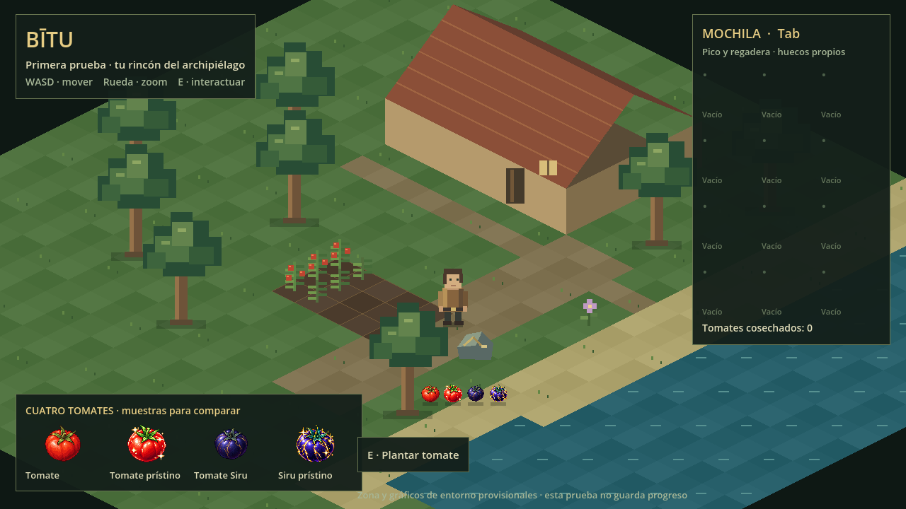

# Prueba visual de Bītu



Una zona provisional para revisar el aspecto, la escala y el farmeo básico.

## Jugar en el navegador

1. Descarga [bitu-navegador.zip](https://github.com/jagoncito/jueguito/raw/refs/heads/main/prueba/descargas/bitu-navegador.zip).
2. Descomprime **todo** el archivo. Necesitas **Python 3** y un navegador actualizado con WebGL 2.
3. Abre una terminal en la carpeta `bitu-navegador` y ejecuta:

   ```sh
   python JUGAR.py
   ```

   Si tu sistema usa `python3`, ejecuta `python3 JUGAR.py`. En Windows también puedes usar `py JUGAR.py`.

Se abre el navegador automáticamente. Mantén la terminal abierta durante la partida; pulsa Ctrl+C al terminar. El ZIP incluye la versión exportada: no necesitas Godot para esta opción. Abrir `index.html` directamente con doble clic no funciona.

## Abrir el proyecto en Godot

1. Descarga el repositorio desde **Code → Download ZIP** y descomprímelo.
2. Instala **Godot 4.6.3 estándar** e importa el archivo `prueba/project.godot`.
3. Pulsa **F5**.

Los cuatro PNG de tomates se incluyen en `assets/objetos/cultivos/` dentro de esta carpeta para que la prueba sea independiente. Son copias idénticas de los originales del repositorio.

## Controles

| Acción | Control |
|---|---|
| Moverse | WASD |
| Zoom | Rueda del ratón |
| Plantar, regar, cosechar, picar o recoger una flor | E al acercarte |
| Mostrar u ocultar la mochila | Tab |
| Recoger botín del suelo | Acercarte |

**No guarda progreso.** Personaje, edificios, terreno y tiempos son provisionales. Los tomates junto a la orilla son muestras para comparar sus diseños; las cosechas normales de esta prueba dan tomate común. Todavía no incluye pesca, barco ni el inicio narrativo del juego.

Consulta [alcance y comprobaciones](../docs/prueba-visual.md). Para regenerar la exportación web, instala las plantillas Godot 4.6.3, crea `build/web` y usa el preset **Web**. Los archivos generados y la caché `.godot` se excluyen de Git.
