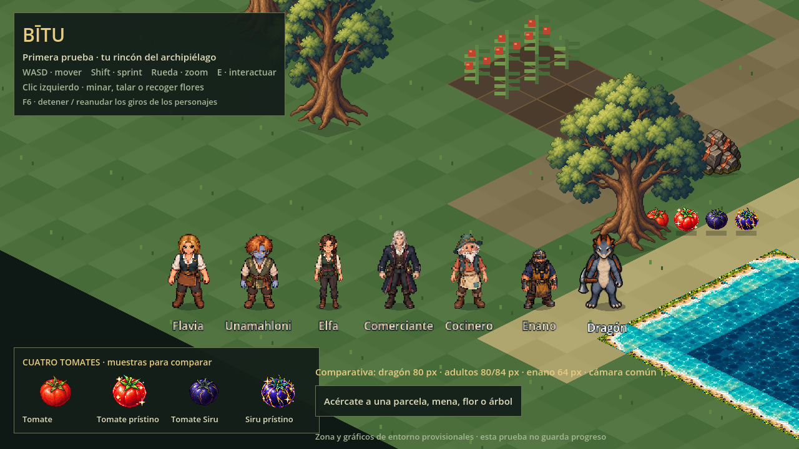
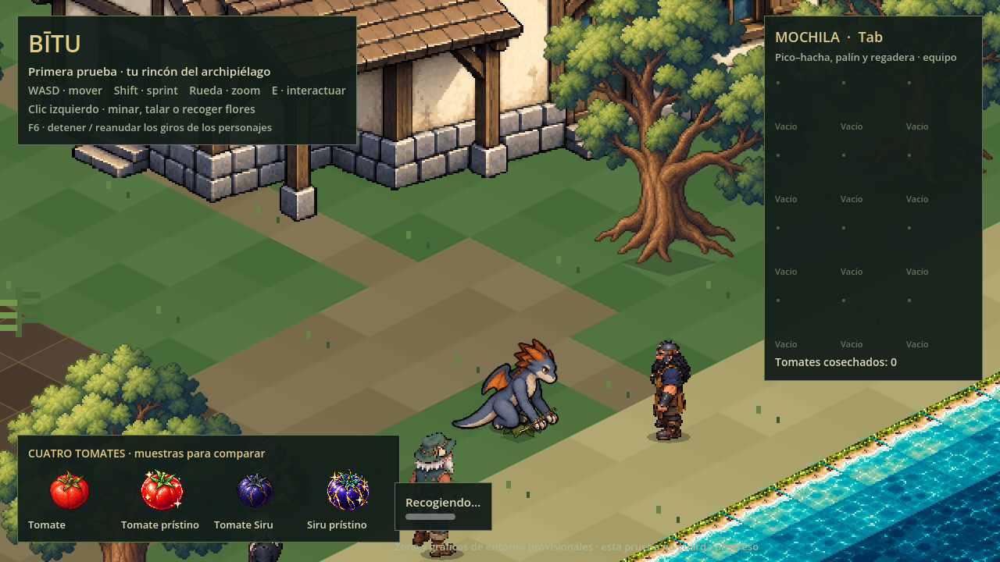
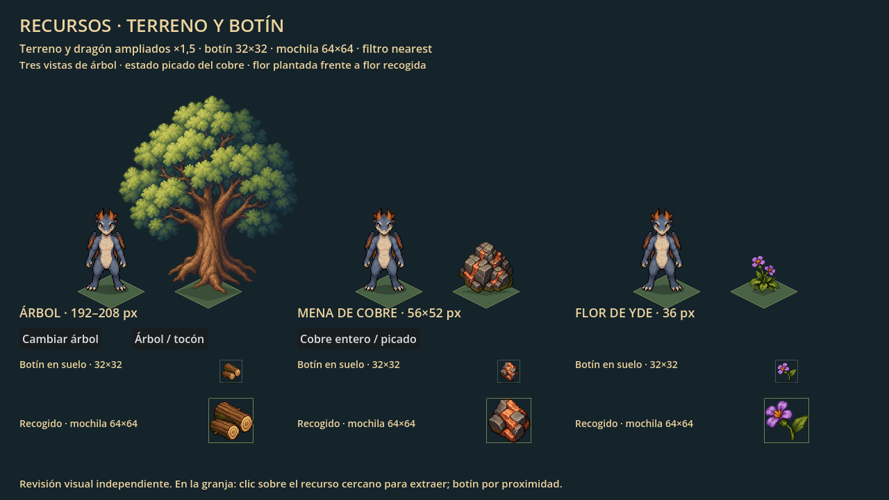
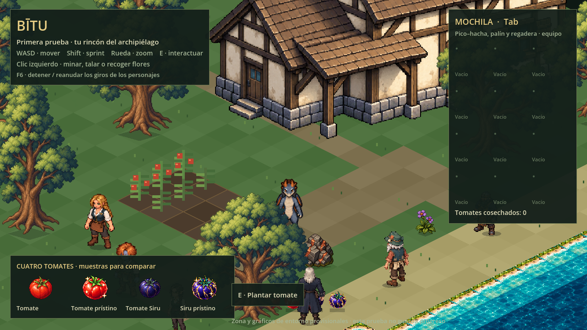
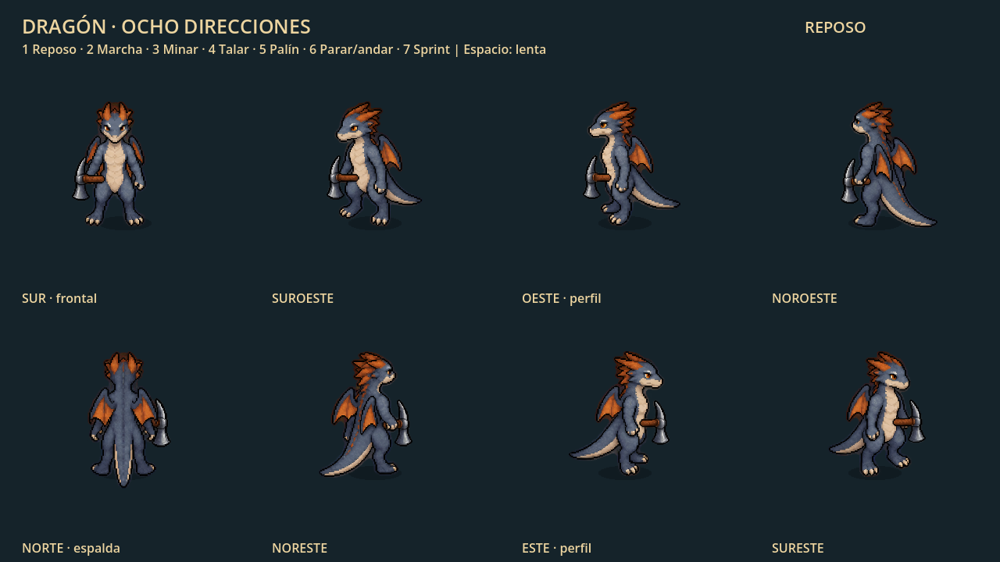

# Prueba visual de Bītu

**Dragón rehecho por completo:** nuevo pixel art con cuerpo esbelto, cabeza menor, contorno fino y paleta más cercana a los NPC.160 registros en ocho direcciones: reposo/sin equipo, caminar, sprint propio, minería, tala y palín. Retirados los recursos anteriores; historial de Git conservado. **Acabado pendiente de revisión visual.**



[Vídeo dentro del juego](capturas/personajes-movimiento.webm) · [Conjunto y medidas](../assets/personajes/dragon/README.md)

Nueve pruebas Godot y seis revisiones WebGL superadas. ZIP27.490.995bytes, CRC correcto, sin paquete antiguo; no ha hecho falta dividirlo para subir.

Los seis habitantes conservan sus posiciones provisionales, ocho vistas, giros breves, colisión e interacciónE de prueba. F6 pausa/reanuda giros; Tab oculta la mochila. Agua/casa y recursos existentes conservados. Cinco golpes por mena/árbol, tiempos y controles intactos; no añade sistemas nuevos.

## Jugar en el navegador

1. Descarga [bitu-navegador.zip](https://github.com/jagoncito/jueguito/raw/refs/heads/main/prueba/descargas/bitu-navegador.zip).
2. Descomprime **todo** el archivo. Necesitas **Python 3** y un navegador actualizado con WebGL 2.
3. Abre una terminal en la carpeta `bitu-navegador` y ejecuta:

   ```sh
   python JUGAR.py
   ```

   Si tu sistema usa `python3`, ejecuta `python3 JUGAR.py`. En Windows también puedes usar `py JUGAR.py`.

Se abre el navegador automáticamente. Mantén la terminal abierta durante la partida; pulsa Ctrl+C al terminar. El ZIP incluye la versión exportada: no necesitas Godot para esta opción. Abrir `index.html` directamente con doble clic no funciona.

## Abrir el proyecto en Godot

1. Descarga el repositorio desde **Code → Download ZIP** y descomprímelo.
2. Instala **Godot 4.6.3 estándar** e importa el archivo `prueba/project.godot`.
3. Pulsa **F5**.

Los cuatro PNG de tomates se incluyen en `assets/objetos/cultivos/` dentro de esta carpeta para que la prueba sea independiente. Son copias idénticas de los originales del repositorio.

## Controles

| Acción | Control |
|---|---|
| Moverse | WASD |
| Sprint | Shift + WASD |
| Zoom | Rueda del ratón |
| Minar, talar o recolectar flores | Un clic izquierdo sobre el recurso cercano |
| Plantar, regar o cosechar | E al acercarte |
| Mostrar u ocultar la mochila | Tab |
| Detener / reanudar los personajes de comparación | F6 |
| Recoger botín del suelo | Acercarte |

**No guarda progreso.** El protagonista es el dragón bípedo, nuevo, con ocho vistas y animaciones mediante poses completas con cola conectada. La marcha tiene cuatro fases distintas por dirección, sigue el desplazamiento real y no se reproduce al quedar bloqueado. El dragón mide 80 px antes del zoom y conserva esa altura al caminar. Lleva el pico–hacha con punta arriba y filo abajo, dibujado junto a las manos; minería y tala tienen poses propias. El palín sigue registrado por separado. Edificios, terreno, tiempos y acabado de movimientos son provisionales. Los tomates junto a la orilla son muestras para comparar sus diseños; las cosechas normales de esta prueba dan tomate común. Todavía no incluye pesca, barco ni el inicio narrativo del juego.

El pico–hacha está equipado y elige automáticamente el extremo correspondiente a mena o árbol. **Un clic inicia toda la extracción**, sin mantener pulsado ni repetir clics por golpe. Al seleccionar una flor, guarda el pico–hacha, se arrodilla y usa el **palín de herborista**; tras extraerla se levanta y recuperas el movimiento. Debes estar cerca; clic en suelo no extrae y clic desde lejos no mueve al personaje. Cada golpe tiene preparación, impacto y recuperación. El golpe final suelta mineral o madera, que se recoge al acercarte; talar deja un tocón transitable. Los árboles no reaparecen hasta reiniciar esta prueba; su regeneración definitiva queda pendiente.



## Árboles, cobre y flor de Yde

Los dos atlas que faltaban se han creado por petición del usuario, con perspectiva elevada, fondo transparente y filtro nearest. Los recortes y anclas se han medido sobre estas fuentes nuevas; la copia dentro de la prueba es idéntica a la de la raíz. Árboles de 192–208 px, cobre dentro de 56×52 px, Yde de 36 px y botín de hasta 28 px dentro del marco 32×32.

La granja usa ahora tres variantes de árbol con sus tocones, mena de cobre entera y picada, y Yde violeta plantada. El botín tiene dibujos independientes: troncos cortados, un fragmento de mineral y una flor con tallo corto. Se mantienen los tiempos, cantidades y recogida por proximidad del prototipo.



Abre `scenes/recursos.tscn` y pulsa **F6**, o añade **`?vista=recursos`** a la URL del navegador. Los botones alternan las tres vistas de árbol, árbol/tocón y cobre entero/picado. El terreno y el dragón se muestran ampliados ×1,5; botín 32×32 y mochila 64×64. [Ficha y atlas originales](../assets/entorno/recursos/README.md).



## Revisar el dragón y sus animaciones

Abre `scenes/dragon.tscn` en el editor de Godot y pulsa **F6** para ver las ocho direcciones ampliadas ×2. **1 reposo, 2 marcha, 3 minar, 4 talar, 5 palín, 6 parar/andar,7 sprint**. Son las mismas poses y herramientas utilizadas en la granja. El modo 6 compara el reposo con los cuatro pasos. En el navegador añade **`?vista=dragon`** a la URL abierta por `JUGAR.py`. [Ficha del personaje](../assets/personajes/dragon/README.md) · [Vídeo real del canvas](capturas/dragon-animaciones.webm) · [Transición reposo/marcha](capturas/dragon-parar-andar.webm).



Consulta [alcance y comprobaciones](../docs/prueba-visual.md). Para regenerar la exportación web desde la raíz del repositorio, ejecuta `python prueba/tools/export_web.py` con Godot 4.6.3 disponible. Reutiliza el runtime web comprobado del ZIP existente y exporta los datos actuales, sin descargar plantillas. También puedes instalar las plantillas 4.6.3 y exportar mediante el preset **Web**. `build/` y la caché `.godot` se excluyen de Git.

## Revisar el pico–hacha

Abre `scenes/herramienta.tscn` en Godot y pulsa **F6**. Muestra el dragón y el [pico–hacha de hierro](../assets/herramientas/pico-hacha/README.md), con proporciones reales ampliadas ×4. **1** reproduce minería, **2** tala y **R** restaura las poses. Esta revisión independiente se conserva; **F5** abre la granja con la herramienta integrada. Las mejoras de materiales todavía no son jugables.

La captura anterior con humano se ha retirado al sustituirla por el dragón.

## Escala común dentro del juego

Los seis NPC tienen sprites nativos a escala de mundo y el protagonista usa sus nuevos atlas registrados, conservando las estaturas. Revisión: `prueba/scenes/personajes.tscn` (F6), o `?vista=personajes` en la descarga web. Flechas: vistas; Espacio: marcha del dragón; V: poses del dragón; Z: zoom común. Recursos y medidas: `assets/personajes/escala-juego/README.md`. El dragón y los seis NPC aparecen también en la partida principal; su distribución es provisional.

Conjunto simplificado: seis NPC con ocho vistas de reposo cada uno y protagonista nuevo con160 registros (208 en total).

## Habitantes integrados y comparación de escala

Los seis NPC están en posiciones provisionales del mapa y giran brevemente sobre el sitio; F6 pausa/reanuda los giros. Al acercarte miran al protagonista y **E** muestra una conversación de prueba. No incluye servicios ni diálogos definitivos. **F7**: dragón80px actual. **F8**: alternativa72px; se restablece al recargar. NPC y zoom sin cambios. [Capturas, mediciones y explicación](../docs/revision-personajes-en-juego.md).
