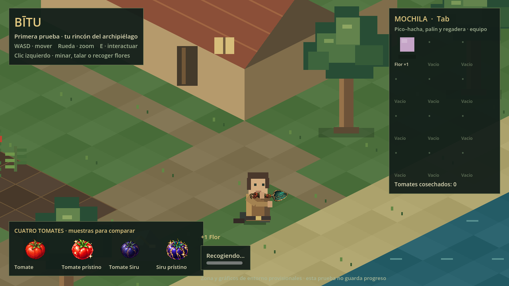
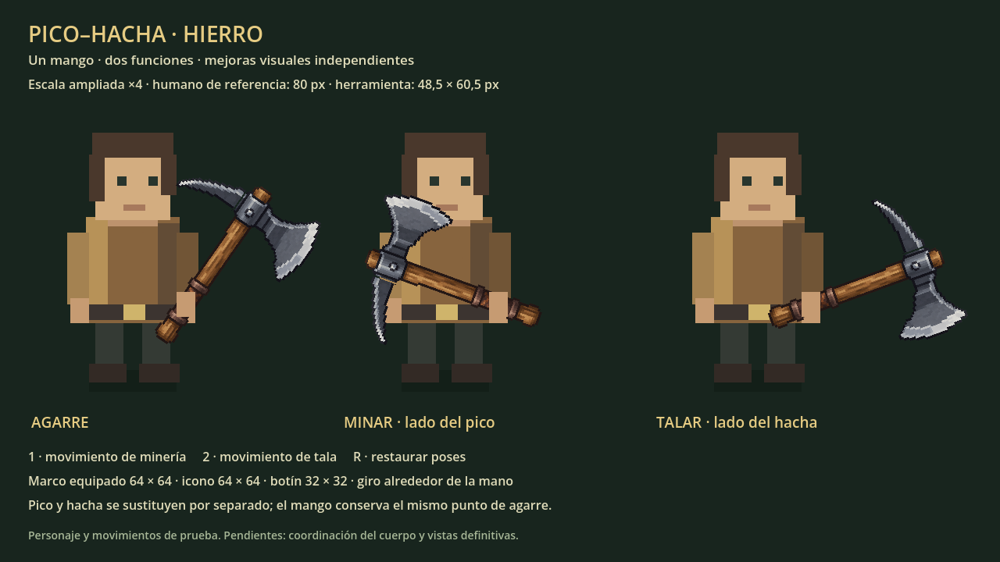

# Prueba visual de Bītu


Una zona provisional para revisar el aspecto, la escala y el farmeo básico.

## Jugar en el navegador

1. Descarga [bitu-navegador.zip](https://github.com/jagoncito/jueguito/raw/refs/heads/main/prueba/descargas/bitu-navegador.zip).
2. Descomprime **todo** el archivo. Necesitas **Python 3** y un navegador actualizado con WebGL 2.
3. Abre una terminal en la carpeta `bitu-navegador` y ejecuta:

   ```sh
   python JUGAR.py
   ```

   Si tu sistema usa `python3`, ejecuta `python3 JUGAR.py`. En Windows también puedes usar `py JUGAR.py`.

Se abre el navegador automáticamente. Mantén la terminal abierta durante la partida; pulsa Ctrl+C al terminar. El ZIP incluye la versión exportada: no necesitas Godot para esta opción. Abrir `index.html` directamente con doble clic no funciona.

## Abrir el proyecto en Godot

1. Descarga el repositorio desde **Code → Download ZIP** y descomprímelo.
2. Instala **Godot 4.6.3 estándar** e importa el archivo `prueba/project.godot`.
3. Pulsa **F5**.

Los cuatro PNG de tomates se incluyen en `assets/objetos/cultivos/` dentro de esta carpeta para que la prueba sea independiente. Son copias idénticas de los originales del repositorio.

## Controles

| Acción | Control |
|---|---|
| Moverse | WASD |
| Zoom | Rueda del ratón |
| Minar, talar o recolectar flores | Un clic izquierdo sobre el recurso cercano |
| Plantar, regar o cosechar | E al acercarte |
| Mostrar u ocultar la mochila | Tab |
| Recoger botín del suelo | Acercarte |

**No guarda progreso.** Personaje, edificios, terreno y tiempos son provisionales. Los tomates junto a la orilla son muestras para comparar sus diseños; las cosechas normales de esta prueba dan tomate común. Todavía no incluye pesca, barco ni el inicio narrativo del juego.

El pico–hacha está equipado y elige automáticamente el extremo correspondiente a mena o árbol. **Un clic inicia toda la extracción**, sin mantener pulsado ni repetir clics por golpe. Al seleccionar una flor, guarda el pico–hacha, se arrodilla y usa el **palín de herborista**; tras extraerla se levanta y recuperas el movimiento. Debes estar cerca; clic en suelo no extrae y clic desde lejos no mueve al personaje. Cada golpe tiene preparación, impacto y recuperación. El golpe final suelta mineral o madera, que se recoge al acercarte; talar deja un tocón transitable. Los árboles no reaparecen hasta reiniciar esta prueba; su regeneración definitiva queda pendiente.



Consulta [alcance y comprobaciones](../docs/prueba-visual.md). Para regenerar la exportación web desde la raíz del repositorio, ejecuta `python prueba/tools/export_web.py` con Godot 4.6.3 disponible. Reutiliza el runtime web comprobado del ZIP existente y exporta los datos actuales, sin descargar plantillas. También puedes instalar las plantillas 4.6.3 y exportar mediante el preset **Web**. `build/` y la caché `.godot` se excluyen de Git.

## Revisar el pico–hacha

Abre `scenes/herramienta.tscn` en Godot y pulsa **F6**. Muestra el personaje provisional y el [pico–hacha de hierro](../assets/herramientas/pico-hacha/README.md), con proporciones reales ampliadas ×4. **1** reproduce minería, **2** tala y **R** restaura las poses. Esta revisión independiente se conserva; **F5** abre la granja con la herramienta integrada. Las mejoras de materiales todavía no son jugables.


