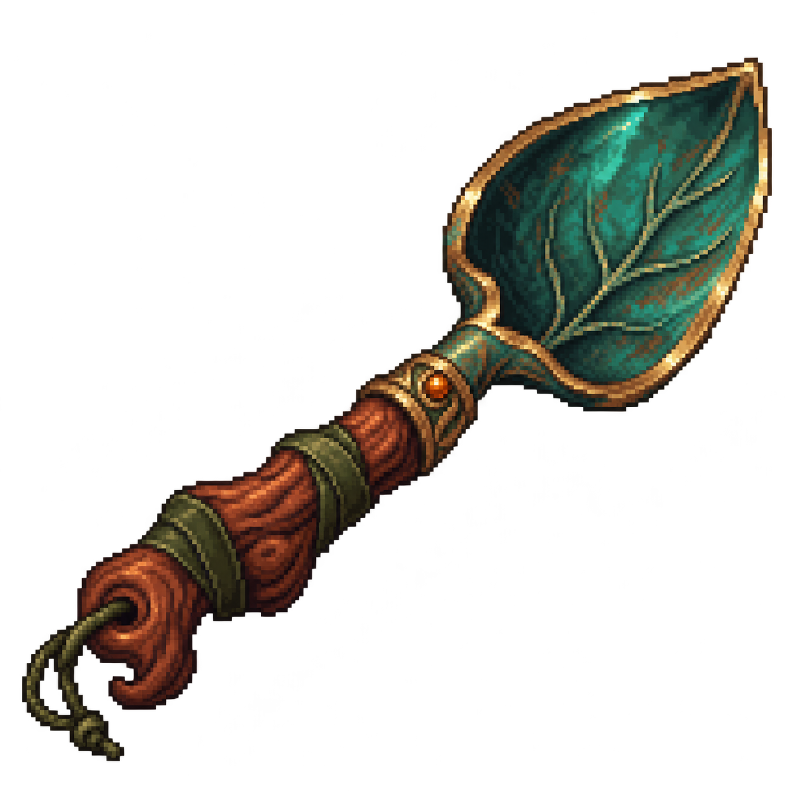

# Palín de herborista — diseño exótico integrado

Diseño generado el **8 de octubre de 2026** por petición explícita del usuario. Pala de mano para herboristería: hoja cóncava vegetal de color verde azulado, borde bronce, nervaduras sutiles, pequeño detalle ámbar y mango de madera retorcida con correas verdes. Paleta y ornamentos son una propuesta visual; no confirman materiales, rareza, poderes ni requisitos.

Integrado en la prueba por petición explícita del usuario. Un clic izquierdo sobre una flor cercana guarda el pico–hacha y equipa el palín: el personaje baja a una rodilla, hace paladas junto a la raíz, extrae la planta y se levanta. El botín aparece al extraer a los **1,5 segundos** y el control vuelve a los **2 segundos**. Animación y tiempos provisionales; el atlas añadido dispone de ocho vistas para el dragón, sin mejoras jugables todavía.

El PNG original **RGBA de 1254 × 1254** se conserva sin modificar. Se presenta con escala **1/32**, equivalente a un lienzo de **39,1875 × 39,1875 píxeles** antes de girarlo, junto al humano de 80 píxeles. Filtrado nearest. No es un sprite nativo de 64 × 64 ni una hoja de fotogramas; esta descripción corresponde al recurso original. El dragón actual usa poses completas y el atlas direccional registrado.

`palin-herborista.tscn` compone el PNG con el origen en el **agarre (440,820)** del original; posición del Sprite2D (5,84375; −6,03125), escala 0,03125. El punto de contacto de la hoja se registra en **(1170,155)** del original. `palin.gd` anima el giro, emite `impact("recolectar")` una vez al extraer y `work_finished` al terminar. El personaje orienta el montaje hacia la tierra y coordina mano, postura y recuperación.

Metadatos: [palin-herborista.json](palin-herborista.json). La copia del proyecto está en `prueba/assets/herramientas/palin-herborista/`. Abrir `prueba/project.godot` y usar **F5**; acercarse a la flor y hacer clic sobre ella. Imagen original y copia del proyecto idénticas.

La integración actual usa `palin-vistas.png` y `palin-vistas.json`: ocho perspectivas espaciales con agarre y punta propios. El dragón utiliza poses completas, con palma registrada y dedos sobre el mango; el cuerpo ocluye las vistas traseras. El original permanece como referencia. Véase la [ficha actualizada](../../../../assets/herramientas/palin-herborista/README.md).

Las pruebas de la escena y del dragón verifican agarre, contacto en ocho direcciones, postura, ausencia de botín duplicado y recuperación. La subida de esta entrega fue solicitada expresamente; no autoriza futuras subidas automáticas.
